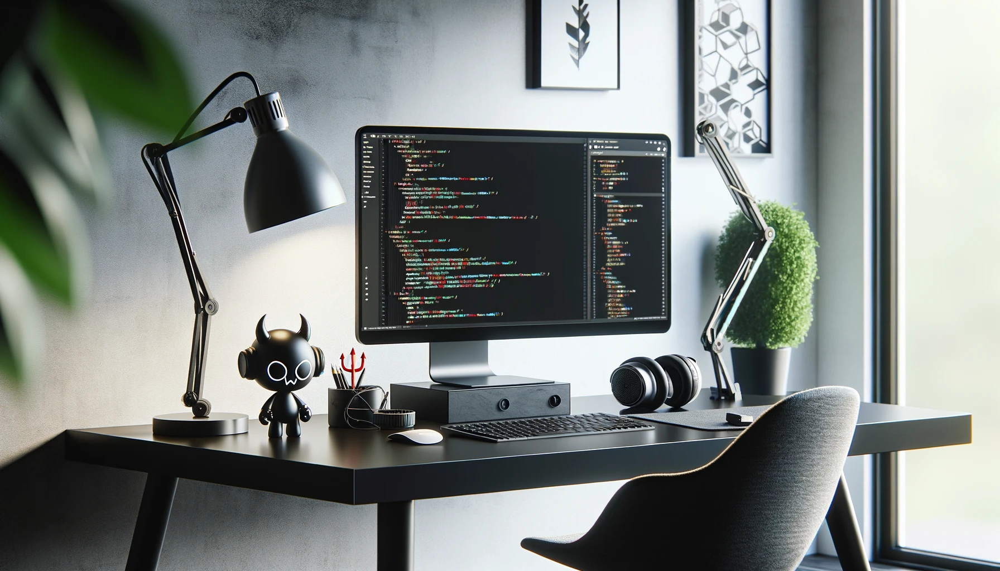

The realm of technology often conjures images of stark minimalism and rigid efficiency. However, this depiction overlooks the whimsy and creativity that are integral to technological innovation. In
this post, we celebrate the lighter side of tech by showcasing a unique workspace setup that marries functionality with fun.

## Embracing Creativity

The featured image captures a sleek, modern workspace - a testament to the elegance that technology can embody. Yet, amidst the monochrome palette and contemporary design, a tiny devil figurine stands
on the desk, a symbol of playfulness in the often too-serious tech landscape.

## The Workspace

The image shows a high-resolution monitor, the gatekeeper of code, flanked by high-end headphones and a stylish desk lamp. It’s a space that clearly speaks to the serious coder at work. But the
presence of the cartoon-style devil with its mischievous smile suggests a playful challenge to the status quo.

## Workspace Description

A modern tech-themed office space with a minimalist black desk. Features include a code editor on the monitor, high-end headphones, and a tiny devil figurine adding a touch of playfulness.

## A Touch of Personality

While many workspaces strive for a purely utilitarian setup, this image reminds us that a bit of personality can spark joy and inspire creativity. The devilish figure might be a developer's mascot, a
talisman against bugs, or simply a conversation starter.

## Personal Touch

Embrace the quirkiness in your workspace. Whether it's a figurine, a unique piece of art, or an unconventional tool, these items make your space uniquely yours.

## Conclusion

Technology and creativity are not mutually exclusive. As this workspace demonstrates, they can coexist beautifully, encouraging us to think outside the box and inject a little levity into our
day-to-day tasks. Let's not forget that at the heart of every gadget, app, and line of code is a human touch - one that's capable of humor, imagination, and a bit of rebellious spirit.

Remember, your workspace is more than just a place to work; it's a canvas where the tech of today meets the creativity of tomorrow.

This markdown blog post uses the template provided, with a playful twist to showcase the balance between a professional coding environment and the introduction of a whimsical element, reflecting on
how such touches can inspire and invigorate the creative process.
